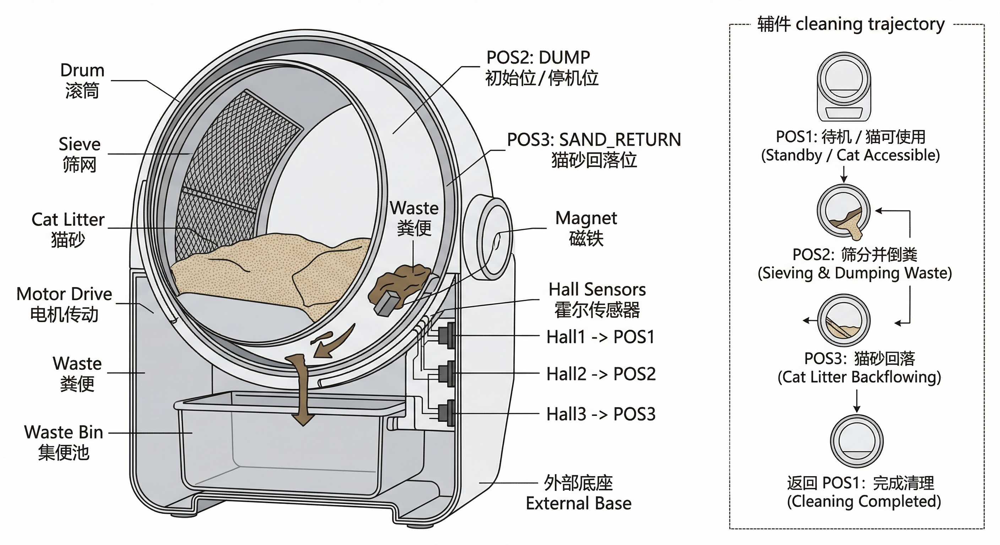

# RT-Thread-Based-Smart-Cat-Litter-Box

基于 HC32F460 和 RT-Thread 的智能猫砂盆嵌入式控制项目。项目围绕本地清理控制链路展开，包含显式状态机、安全联锁、故障恢复、三霍尔位置闭环、本地可观测性以及最小 MQTT 状态上报能力。

这份 README 面向接手项目的开发者，重点说明：

- 项目做什么，范围到哪里
- 控制主线如何组织
- 如何构建、烧录、运行和调试
- 如何快速看懂状态机、联锁和 Hall 闭环

建议阅读顺序：

1. 本文，建立整体认知
2. [`docs/architecture.md`](docs/architecture.md)，查看模块分层和控制主线
3. [`docs/debug-and-demo.md`](docs/debug-and-demo.md)，按步骤完成构建、上电、观察和演示
4. [`app_logic/fsm.c`](app_logic/fsm.c) 与 [`app_logic/logic.c`](app_logic/logic.c)，对照实际实现

## 项目简介

该项目面向带翻转清理机构的猫砂盆本地控制场景。系统将占用检测、重量阈值、三霍尔位置反馈、电机动作、故障处理和本地/云端状态可见性组织成一条完整的嵌入式控制链路。

当前代码基线覆盖的核心问题包括：

1. 用显式状态机管理待机、占用、离开确认、清理延时、清理执行、安全停机和故障恢复。
2. 用统一的联锁逻辑处理 `occupied`、`bin_full` 和清理中的保护停机。
3. 用三路霍尔位置反馈驱动 `CLEANING` 阶段闭环推进，并保留 timeout 作为兜底保护。

项目的核心价值是：提供一个可构建、可调试、可继续开发的 RT-Thread 机电控制工程基线。

## 结构与清理过程示意

先看设备结构和清理过程，再对照后文的状态机、联锁和 Hall 闭环，会更容易理解代码逻辑。

图片由AI绘制，用于辅助理解猫砂盆结构以及清理流程，但还是以文字为主。



### 清理过程说明

#### POS1：待机位

* 滚筒处于初始姿态
* 猫砂自然分布在滚筒底部
* 粪便出口位于滚筒上方
* 内部有一张**斜向连续隔板（含筛网区域）**
* 猫可正常进入使用

#### POS2：筛分 + 倒粪

* 滚筒开始正转
* 猫砂通过筛网落入隔板下方区域
* 粪便无法通过筛网，被保留在筛网上方
* 随着滚筒继续旋转，粪便被带动移动至**滚筒底部的出口位置（此时出口朝下）**
* 粪便从出口掉落并进入集便池

#### POS3：猫砂回流

* 滚此时反转至回流姿态
* 隔板结构使筛网下方的猫砂开始重新流动
* 猫砂从隔板下方区域经过筛网流出
* 重新回到主腔体，为恢复初始状态做准备

#### 返回 POS1：完成清理

* 滚筒正转
* 猫砂重新均匀落回滚筒底部
* 系统恢复待机状态
* 结构回到初始几何关系，可立即再次使用

从代码阅读角度，可以重点建立下面三层对应关系：

- 顶层状态机负责决定何时允许开始清理、何时保护停机、何时进入故障恢复
- `CLEANING` 阶段内部的相位推进对应机构的翻转、倒砂、回砂和归位过程
- 三个 Hall 位置 `POS1_HOME`、`POS2_DUMP`、`POS3_SAND_RETURN` 对应清理过程中的关键机械位置

## 当前能力边界

### 已实现

- 顶层状态机：`IDLE`、`OCCUPIED`、`LEAVE_CONFIRM`、`CLEAN_DELAY`、`CLEANING`、`SAFE_STOP`、`FAULT`
- 清理主线：离开确认、清理延时、清理执行、故障恢复
- 安全联锁：`occupied` 禁启、清理中保护停机、`bin_full` 阻止清理
- 清理闭环：`POS1 -> POS2 -> POS3 -> POS1`
- Hall 去抖与位置稳定判定
- OLED、串口日志、finsh 三种本地可观测入口
- MQTT 周期状态上报与远程清理触发

### 未纳入当前范围

- 新的顶层状态或新的清理策略
- 新的联锁类型或扩展故障码体系
- App / UI / OTA / 云端编排
- 新硬件平台迁移和新传感器扩展
- 与文档整理无关的大规模重构

### 取舍说明

本仓库当前以本地控制闭环为中心，优先保证状态、联锁、恢复和调试路径清晰稳定。新增能力应建立在现有控制主线已经可解释、可验证的前提上。

## 核心设计思路

### 显式状态机

状态机定义在 [`app_logic/fsm.h`](app_logic/fsm.h) 和 [`app_logic/fsm.c`](app_logic/fsm.c)。关键事件通过 `litter_fsm_dispatch()` 进入，周期性超时和自动恢复逻辑由 `litter_fsm_tick()` 统一处理。

这种组织方式带来的直接收益是：

- 状态与事件名称可直接用于串口日志和故障定位
- 联锁规则集中在状态机内表达
- 清理执行阶段可以继续细化，而不影响顶层状态语义

### 安全联锁

联锁规则覆盖清理前和清理中两个阶段：

- `occupied=1` 时不进入清理
- 清理中再次检测到占用时立即停机并进入 `SAFE_STOP`
- `bin_full=1` 时阻止清理，并进入 `FAULT`
- `RESET` 恢复动作仍受保护和满仓条件约束

本地 finsh 触发和 MQTT 下行触发共用相同的状态机入口，不会绕开联锁判断。

### 故障恢复与关键告警

项目当前保留三个关键故障原因：

- `BIN_FULL`
- `CLEAN_TIMEOUT`
- `PROTECT_TRIGGER`

故障和保护状态可以通过以下渠道观察：

- OLED 摘要信息
- 串口日志中的 `[FSM]` / `[LOGIC]` / `[ACT]` / `[MQTT]`
- finsh 命令 `litter_status`
- MQTT 上报字段 `fault_code` / `fault_text`

### 本地自治优先

MQTT 在系统中的职责是：

- 周期上报最小状态摘要
- 接收远程清理请求

本地状态机、联锁和故障恢复不依赖 MQTT 在线。故障恢复入口保留在本地，远程下行不参与 fault reset。

### 三霍尔位置闭环

三霍尔位置反馈接入 [`app_logic/logic.c`](app_logic/logic.c)，清理阶段推进由 [`app_logic/fsm.c`](app_logic/fsm.c) 处理。

当前定义的机械位置为：

- `POS1_HOME`
- `POS2_DUMP`
- `POS3_SAND_RETURN`

它们用于描述清理过程中的机构位置。顶层状态机负责系统运行语义，`CLEANING` 内部相位负责机构轨迹推进。

## 系统架构

### 控制主线

```text
红外占用 / 重量 / 霍尔 / DHT11
          |
          v
  Sensor Task + Control Task
          |
          v
      FSM / Interlock
          |
          +--> 电机动作
          +--> OLED 摘要
          +--> 串口日志 / finsh
          +--> MQTT 最小状态上报
```

### 线程职责

| 线程 | 入口 | 主要职责 |
| --- | --- | --- |
| `sensor_th` | `ReadSensor_Task()` | 采集 DHT11 数据，更新温湿度邮箱 |
| `con_th` | `StartControl_Task()` | 执行输入同步、状态机驱动、Hall 闭环调度 |
| `mqtt_th` | `Mqtt_Task()` | 建链、订阅、周期上报、断线重连 |

线程创建位于 [`app_logic/app_init.c`](app_logic/app_init.c)。

### 关键模块与文件位置

| 文件 | 作用 |
| --- | --- |
| [`applications/main.c`](applications/main.c) | 系统入口、LED 指示、OLED 摘要显示 |
| [`app_logic/app_init.c`](app_logic/app_init.c) | 线程、邮箱、信号量、MQTT 线程启动 |
| [`app_logic/fsm.c`](app_logic/fsm.c) | 顶层状态机、联锁、超时、故障恢复 |
| [`app_logic/logic.c`](app_logic/logic.c) | 输入同步、Hall 采样去抖、finsh 命令 |
| [`app_logic/mqtt.c`](app_logic/mqtt.c) | MQTT 最小上下行协议 |
| [`board/`](board/) | BSP、串口、时钟、链接脚本 |
| [`libraries/`](libraries/) | HC32F460 DDL 与 RT-Thread BSP 驱动 |

## 状态机说明

### 顶层状态

| 状态 | 语义 |
| --- | --- |
| `IDLE` | 空闲待机，可接受清理请求 |
| `OCCUPIED` | 检测到占用，禁止清理 |
| `LEAVE_CONFIRM` | 离开确认窗口 |
| `CLEAN_DELAY` | 清理前延时窗口 |
| `CLEANING` | 执行清理轨迹 |
| `SAFE_STOP` | 清理中保护触发后的停机等待状态 |
| `FAULT` | 故障锁定状态 |

默认时间参数在 [`app_logic/fsm.c`](app_logic/fsm.c) 中初始化：

- `leave_confirm_ms = 2000`
- `clean_delay_ms = 5000`
- `timeout_to_pos2_ms = 6000`
- `timeout_to_pos3_ms = 5000`
- `timeout_to_pos1_ms = 6000`
- `clean_total_timeout_ms = 20000`

### `CLEANING` 三位置轨迹

清理阶段按目标位置推进：

1. 进入 `CLEANING` 后启动 `TO_POS2`
2. 到达 `POS2_DUMP` 后切换到 `TO_POS3`
3. 到达 `POS3_SAND_RETURN` 后切换到 `TO_POS1`
4. 回到 `POS1_HOME` 后触发 `EVT_CLEAN_DONE` 并结束清理

### 关键事件

| 事件 | 作用 |
| --- | --- |
| `EVT_OCCUPIED_ON` / `EVT_OCCUPIED_OFF` | 占用进入 / 离开 |
| `EVT_DELAY_TIMEOUT` | 离开确认或清理延时到期 |
| `EVT_CLEAN_START` | 发起清理 |
| `EVT_POS1_REACHED` / `EVT_POS2_REACHED` / `EVT_POS3_REACHED` | Hall 到位事件 |
| `EVT_PROTECT_TRIGGER` / `EVT_PROTECT_RELEASE` | 保护触发 / 释放 |
| `EVT_STALL_OR_TIMEOUT` | 阶段超时或总超时 |
| `EVT_BIN_FULL` | 满仓事件 |
| `EVT_RESET` | 本地恢复请求 |

### 关键故障

| 故障码 | 含义 |
| --- | --- |
| `FSM_FAULT_BIN_FULL` | 满仓，清理被阻止 |
| `FSM_FAULT_CLEAN_TIMEOUT` | 清理阶段或总流程超时 |
| `FSM_FAULT_PROTECT_TRIGGER` | 保护触发来源码，用于 `SAFE_STOP` |

### `SAFE_STOP` 与 `FAULT`

- `SAFE_STOP` 用于清理中的保护停机，系统等待保护条件释放后恢复到可运行状态
- `FAULT` 用于故障锁定，系统在故障条件解除或本地恢复前不继续清理

当前实现中：

- 清理中占用触发进入 `SAFE_STOP`
- 满仓进入 `FAULT`
- 清理超时进入 `FAULT`
- `SAFE_STOP` 在保护释放后恢复到 `OCCUPIED` 或 `LEAVE_CONFIRM`
- `BIN_FULL` 在重量回落后可自动清除
- `CLEAN_TIMEOUT` 需要本地 `RESET`

## 安全联锁说明

### `occupied` 禁启

- `IDLE`、`OCCUPIED`、`LEAVE_CONFIRM`、`CLEAN_DELAY` 中，只要占用成立，就不进入清理
- 离开确认或清理延时期间重新检测到占用时，状态机回到 `OCCUPIED`

### 清理中保护停机

- `CLEANING` 中再次检测到占用时触发 `EVT_PROTECT_TRIGGER`
- 状态机进入 `SAFE_STOP` 并立即停机
- 保护释放后，系统根据当前输入恢复到 `OCCUPIED` 或 `LEAVE_CONFIRM`

### `bin_full` 禁启

- 满仓当前由重量阈值代理：`cur_weight >= 500`
- 满仓时清理请求不进入 `CLEANING`
- `SAFE_STOP` 恢复阶段若发现满仓，状态机会转入 `FAULT`

### `RESET` / `SAFE_STOP` / 故障恢复边界

- `RESET` 为本地恢复入口
- `RESET` 执行时仍检查 `protect_active` 和 `bin_full`
- MQTT 下行不参与 fault reset
- 保护停机和故障锁定分别由 `SAFE_STOP` 与 `FAULT` 表达

## 霍尔位置闭环说明

### POS1 / POS2 / POS3 的机械语义

- `POS1_HOME`：待机 / 回零位置
- `POS2_DUMP`：倒砂位置
- `POS3_SAND_RETURN`：砂回流位置

### 三霍尔输入在软件里的角色

当前代码将三霍尔作为 one-hot 位置编码：

- `0x01` -> `POS1_HOME`
- `0x02` -> `POS2_DUMP`
- `0x04` -> `POS3_SAND_RETURN`
- `0x00` -> `TRANSITION`
- 其他组合 -> `INVALID`

并在软件中加入：

- `10 ms` 采样周期
- `20 ms` 去抖
- 相位去重，避免同一个稳定位置被重复消费

### Hall 与顶层状态机的关系

顶层状态机负责系统行为语义，如占用、清理、保护停机和故障恢复。Hall 反馈负责 `CLEANING` 阶段的机构位置推进。两者分层后，控制逻辑更容易阅读和维护。

### timeout 兜底保护

Hall 到位是清理闭环的主要推进条件，timeout 保留为异常路径保护，用于处理卡滞、接线错误、未到位或长时间停留在过渡区等情况。

## 构建与运行

### 依赖的硬件模块

当前代码默认依赖以下硬件基础：

- HC32F460 主控
- 电机驱动，两路控制输出 `IN1/IN2`
- 红外占用检测，当前代码使用 `PE2`，低电平表示占用
- 三路霍尔位置反馈，当前代码使用 `PA4 / PA5 / PA6`，低电平有效
- 称重模块，当前通过 `cur_weight` 参与满仓判定
- DHT11，当前数据脚为 `PE10`
- SSD1306 OLED，I2C 总线为 `i2c2`
- MQTT 联网基础，沿用现有 Ali IoT 配置

详细的硬件组成、参考 BOM 对照、快速接线表、总线映射和 GPIO 引脚表见 [`docs/hardware-config.md`](docs/hardware-config.md)。

### 构建方式

#### Keil MDK

1. 打开 [`project.uvprojx`](project.uvprojx)
2. 编译工程
3. 使用工程下载配置烧录到目标板

#### IAR

1. 打开 [`project.eww`](project.eww) 或 [`project.ewp`](project.ewp)
2. 编译工程
3. 使用 IAR 下载配置烧录到目标板

#### SCons

在仓库根目录执行：

```bash
scons
```

说明：

- `SConstruct` 默认将 `RTT_ROOT` 指向仓库内的 `rt-thread`
- 命令行构建适合做本地编译验证

### 烧录 / 上电前检查项

1. 控制台设备为 `uart4`
2. 串口默认参数为 `115200 8N1`
3. 机构初始位置建议接近 `POS1_HOME`
4. Hall 输入接线与 `PA4 / PA5 / PA6` 假设一致
5. 如需 MQTT，先确认设备密钥和联网链路可用

### 上电后如何观察系统状态

系统上电后可以从三处观察运行情况：

- OLED：查看重量、使用次数、状态、故障、链路、满仓、保护、温湿度
- 串口：查看状态跳转、Hall 稳定位置、动作方向、故障进入与恢复
- finsh：主动查询状态、触发清理、执行恢复和注入 timeout

## 调试与演示

### OLED / 串口 / finsh

- OLED 适合看运行摘要
- 串口适合看状态机与动作日志
- finsh 适合做本地调试和演示

### 常用 finsh 命令

| 命令 | 作用 |
| --- | --- |
| `litter_status` | 查看状态、相位、Hall 位置、故障、满仓、保护、MQTT 链路 |
| `litter_clean` | 排队一次本地清理请求 |
| `litter_reset` | 请求本地恢复 |
| `litter_timeout` | 在 `CLEANING` 中注入 timeout fault，用于调试 |

### 推荐演示路径

#### 1. 基本闭环

1. 上电后执行 `litter_status`
2. 确认系统位于 `IDLE` 或可进入清理的状态
3. 执行 `litter_clean`
4. 观察串口日志是否按 `TO_POS2 -> TO_POS3 -> TO_POS1` 推进
5. 再次执行 `litter_status`，确认系统回到空闲状态

#### 2. `SAFE_STOP` 演示

1. 让系统进入 `CLEANING`
2. 清理中触发占用输入
3. 观察系统停机并进入 `SAFE_STOP`
4. 释放占用后，观察系统恢复到 `OCCUPIED` 或 `LEAVE_CONFIRM`

#### 3. `FAULT` 与恢复演示

1. 让系统进入 `CLEANING`
2. 执行 `litter_timeout`
3. 观察系统进入 `FAULT`
4. 清除保护 / 满仓条件后执行 `litter_reset`
5. 观察系统恢复到 `IDLE` 或 `OCCUPIED`

详细调试路径见 [`docs/debug-and-demo.md`](docs/debug-and-demo.md)。

## 目录结构说明

```text
sourcecode/
├── app_logic/          # 业务控制主线：FSM、输入同步、Hall 闭环、MQTT
├── applications/       # main 入口、OLED 刷新
├── board/              # BSP、串口、时钟、链接脚本
├── docs/               # 开发者补充文档
├── libraries/          # HC32F460 DDL 与 BSP 驱动
├── packages/           # RT-Thread 软件包（DHT11、balance、ssd1306、Ali IoT 等）
├── rt-thread/          # RT-Thread 内核与组件
├── project.uvprojx     # Keil 工程
├── project.ewp/.eww    # IAR 工程 / 工作区
├── SConstruct          # SCons 构建入口
└── README.md
```

## 补充文档

- [`docs/architecture.md`](docs/architecture.md)：模块分层、状态机主线、联锁和 Hall 闭环设计
- [`docs/debug-and-demo.md`](docs/debug-and-demo.md)：构建、上电观察、finsh 命令、演示路径和排障建议
- [`docs/hardware-config.md`](docs/hardware-config.md)：硬件配置入口文档，包含参考 BOM 对照、当前代码已接入的模块、快速接线表、硬件连接总览，以及 UART / I2C / GPIO 详细引脚配置

## 当前已知限制

- Hall 位置与机械语义的映射仍需更多实机验证
- `bin_full` 当前由重量阈值代理，不是独立满仓传感器
- 保护输入当前复用了清理中占用检测逻辑，没有独立执行器保护反馈
- MQTT 仅提供最小状态摘要和简单下行触发
- OLED 仅显示摘要，不提供详细诊断界面
- 当前没有持久化事件历史

## 后续演进方向

- 通过实机测试冻结 Hall 机械映射与安装公差
- 为执行器增加更真实的反馈，例如电流、堵转或驱动器状态
- 增加轻量事件历史，保留最近几次状态跳转和故障原因
- 补强本地调试工具与验证脚本

## 许可证

仓库包含 RT-Thread、HC32F460 厂商驱动和第三方软件包。使用或再发布时，请分别遵循对应目录下的原始许可证与版权声明。
